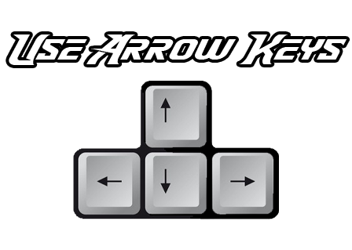

## Dirt Bike Game — HTML5 Canvas

Lightweight, browser‑based dirt bike game built with HTML5 Canvas and vanilla JavaScript. Designed as a focused learning project with clean structure and quick start.

### Project Highlights
- **Vanilla JS, no frameworks**: simple, readable code for quick review
- **Canvas rendering at ~60 FPS**: game loop with `requestAnimationFrame`
- **Light physics**: gravity, friction, rotation, and crash detection
- **Instant restart**: fast iteration and player feedback

### Tech Stack
- **Core**: HTML5 Canvas, JavaScript (ES6), minimal CSS
- **Assets**: `moto.png`, `logo.png`, `pic.jpg`, `pic.png`, `1996.jpg`

### Quick Start
- Open `index.html` directly in a modern browser, or
- Use a static server (e.g., VS Code “Live Server”) for auto‑reload

### Controls
- **Left/Right** (or **A/D**): accelerate / brake
- **Up/Down** (or **W/S**): lean forward / back
- **R**: restart after a crash

### Architecture (Brief)
- **Game loop**: `requestAnimationFrame` updates physics → renders frame
- **Input**: keydown/keyup tracking for smooth control
- **Physics**: position, velocity, rotation, friction, gravity
- **Rendering**: Canvas 2D context draws bike, ground, UI
- **Camera**: lightweight follow to keep the bike centered

### What I Built
- Side‑scrolling bike demo with basic collision and restart flow
- Single‑file implementation in `index.html` for easy code reading

### What I Learned
- Building a reliable game loop and handling delta time
- Clean keyboard input without interfering with page scrolling
- Lightweight physics on Canvas with performance in mind

### Resources and Help
- **MDN Web Docs** for Canvas API and `requestAnimationFrame`
  - [Canvas API](https://developer.mozilla.org/en-US/docs/Web/API/Canvas_API)
  - [`requestAnimationFrame`](https://developer.mozilla.org/en-US/docs/Web/API/window/requestAnimationFrame)
- **Stack Overflow** for key handling patterns and preventing arrow‑key scroll
- **YouTube tutorials** for camera follow and loop structure (search: “html5 canvas game loop”, “canvas platformer physics”)
- **OpenGameArt.org** and **Photopea** for quick sprite/background tweaks

### Roadmap
- Mobile touch controls and on‑screen buttons
- Improved terrain generation and checkpoints
- Sound effects and simple music toggle
- Score, timer, and level progression

— Personal learning project; feel free to explore and adapt.

